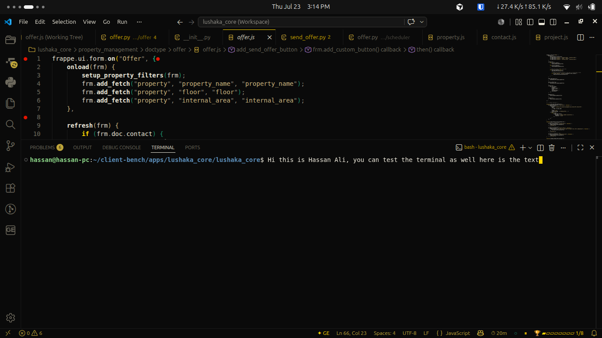
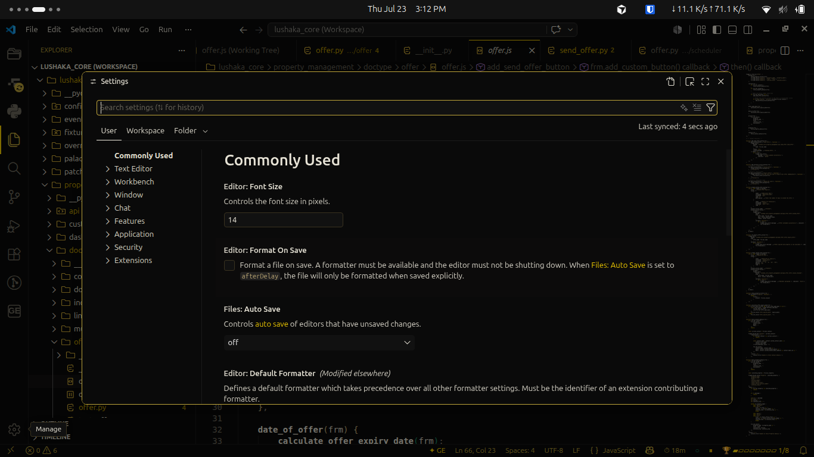

<p align="center">
  
  <h1 align="center">Gold_Elite-2.0</h1>
  <p align="center">
    A premium near-black VS Code theme with a gold-emerald dual-tone accent system.<br>
    Warm. Cohesive. Unmissable. — The signature IDE experience.
  </p>
  <p align="center">
    <a href="https://marketplace.visualstudio.com/items?itemName=hassan-ali.gold-elite-2-0">
      
    </a>
    <a href="https://marketplace.visualstudio.com/items?itemName=hassan-ali.gold-elite-2-0">
      
    </a>
    <a href="LICENSE">
      
    </a>
    <a href="https://marketplace.visualstudio.com/items?itemName=hassan-ali.gold-elite-2-0">
      
    </a>
    <a href="https://github.com/hassan-ali/gold-elite-2-0/stargazers">
      
    </a>
    <a href="https://github.com/hassan-ali/gold-elite-2-0/releases">
      
    </a>
    <a href="https://github.com/hassan-ali/gold-elite-2-0/issues">
      
    </a>
  </p>
  <p align="center">
    <a href="#features">Features</a> •
    <a href="#screenshots">Screenshots</a> •
    <a href="#installation">Installation</a> •
    <a href="#usage">Usage</a> •
    <a href="#commands">Commands</a> •
    <a href="#extension-settings">Settings</a> •
    <a href="#roadmap">Roadmap</a> •
    <a href="#contributing">Contributing</a>
  </p>
  <br>
</p>

<div align="center">
  <table>
    <tr>
      <td align="center"><strong>Theme</strong></td>
      <td align="center"><strong>Type</strong></td>
      <td align="center"><strong>Accent</strong></td>
      <td align="center"><strong>Status Bar</strong></td>
      <td align="center"><strong>Dashboard</strong></td>
      <td align="center"><strong>Icons</strong></td>
      <td align="center"><strong>Privacy</strong></td>
    </tr>
    <tr>
      <td align="center">Near-black</td>
      <td align="center">Signature Experience</td>
      <td align="center">Gold + Emerald</td>
      <td align="center">Living</td>
      <td align="center">Command Center</td>
      <td align="center">Custom File & Product</td>
      <td align="center">Zero Telemetry</td>
    </tr>
  </table>
</div>

<br>

---


---

## Features

<details>
<summary><strong>Luxury Gold-Emberald Theme</strong> — Near-black canvas with coordinated gold-emerald dual-tone</summary>

A meticulously crafted color system built on a `#0A0A0A` near-black canvas. No panel-to-panel tonal variation — pure, uninterrupted focus on your content. The gold (`#FFD700`/`#BFA53A`) and emerald (`#2ECC9A`/`#1F8F6B`) accents are applied consistently across every UI element, syntax token, and semantic highlight.

- **164+ color keys** across the entire workbench
- **Full terminal ANSI** (16 colors) for accurate terminal rendering
- **4-level bracket pair** colorization — `#FFD700` → `#BFA53A` → `#C9B37E` → `#8A8578`
- **Semantic highlighting** for TypeScript/JavaScript — classes, interfaces, enums, type parameters
- **Syntax tokens** for JS/TS, Python, JSON, HTML+CSS, Markdown
- **Safe glow** — simulated through cursor color, selection/highlight layering, and focus borders only — no images, no CSS patches
- **Warm neutral grays** — syntax colors stay in a coordinated tan/gold/gray family

</details>

<details>
<summary><strong>Command Center Dashboard</strong> — Live sidebar dashboard with session stats, Git snapshot, and annotations</summary>

A real-time dashboard in the VS Code sidebar. Tracks your coding session with live-updating stats. Every 5 seconds while visible, the Command Center refreshes with your current session data.

- **Session stats**: edits, lines added/removed, focus time
- **Git snapshot**: current branch, uncommitted changes, ahead/behind
- **Code annotations**: TODO, FIXME, NOTE counts in the active file
- **Recent files**: last 5 opened files with clickable cards
- **Achievements**: all 8 achievements with lock/unlock status

The Command Center auto-opens on startup (configurable) and pauses updates when hidden to save CPU.

</details>

<details>
<summary><strong>Living Status Bar</strong> — Focus timer, save pulse, and coding streak — all optional</summary>

Three status bar items that make the IDE feel alive:

- **Focus Timer** (`⏱`): Tracks focused coding time. Pauses when VS Code is unfocused or idle for 2+ minutes.
- **Save Pulse** (`●`/`○`): A dot that glows gold on every save and fades back to emerald over 800ms.
- **Coding Streak** (`🔥`): Tracks consecutive days with at least one save.
- **HUD** (`🏆`): Achievement progress bar showing unlocked/total achievements.

All status bar items can be individually disabled via settings.

</details>

<details>
<summary><strong>Boot Sequence</strong> — Animated SVG intro with skip gesture and reduced-motion support</summary>

A premium animated boot sequence that plays when opening a workspace. Features an SVG line-art drawing animation, gold-emerald hex badge row, and smooth text fade-in. Skippable on any keypress or click. Respects the `workbench.reduceMotion` setting — automatically switches to a static reveal when enabled.

</details>

<details>
<summary><strong>Save Flash & Gutter Markers</strong> — Visual feedback on save and inline annotation markers</summary>

- **Save Flash**: A 2px gold left-border decoration that animates through 4 opacity steps over 400ms on every save.
- **TODO markers**: Gold circles in the gutter for `TODO` comments.
- **FIXME markers**: Amber circles in the gutter for `FIXME` comments.
- **NOTE markers**: Gray circles in the gutter for `NOTE` comments.

All markers update in real-time as you type, with a debounced re-scan to avoid performance overhead.

</details>

<details>
<summary><strong>Achievement System</strong> — 8 local-only milestones that unlock as you code</summary>

A gamified achievement system that rewards coding milestones. All data stored exclusively in VS Code's local `globalState` — nothing is synced or transmitted.

| Achievement | How to Unlock |
|---|---|
| **First Light** | Save your first file |
| **Momentum** | Reach 100 total saves |
| **Night Owl** | Save between 12am–4am |
| **Streak Keeper** | Maintain a 7-day streak |
| **Bracket Master** | Type 10,000 brackets |
| **Debugger** | Start 10 debug sessions |
| **Clean Sweep** | Eliminate all TODOs from a file |
| **The Elite** | Unlock all 7 other achievements |

</details>

<details>
<summary><strong>Ecosystem Theming</strong> — Optional one-click palette alignment for GitLens, Git Graph, and Error Lens</summary>

Detects installed extensions (GitLens, Git Graph, Error Lens) and offers a one-time prompt to align their colors with the Gold Elite palette. Never modifies settings without explicit approval. After applying, you can revert changes through each extension's own settings.

</details>

<details>
<summary><strong>Privacy-First Architecture</strong> — Zero network calls, zero telemetry, verifiable</summary>

Gold Elite makes no network requests of any kind. No telemetry, no analytics, no external APIs, no cloud sync. All data is stored locally in VS Code's `globalState` and `workspaceState`. The full privacy policy is documented in [`PRIVACY.md`](PRIVACY.md) and verifiable by inspecting the source code.

</details>

---

## Why Gold Elite?

**Gold Elite is not just a color theme — it's a complete IDE experience.**

Most VS Code themes stop at color tokens. Gold Elite goes further: a living status bar that tracks your focus time, a dashboard that shows your Git state at a glance, achievement milestones that make coding feel rewarding, and a visual language that's consistent across every pixel of the interface.

Every feature has its own off-switch. Every animation respects reduced-motion. Zero data leaves your machine. It's a premium experience that stays out of your way when you don't need it and feels incredible when you do.

---

## Screenshots

<div align="center">

### Welcome Screen


*The gold-emerald dual-tone system extends to the Welcome page and Getting Started tiles.*

---

### Command Center


*Live dashboard with session stats, Git snapshot, annotations, and achievements.*

---

### Python Color Palette


*Warm neutral grays with gold-emerald accents for Python syntax.*

---

### JavaScript Color Palette


*Coordinated tan/gold/gray family for JavaScript with semantic token colors.*

---

### JSON Color Palette


*Clean, readable JSON rendering with warm accent colors.*

---

### Terminal



*Full 16-color ANSI terminal integration — no more mismatched terminal colors.*

---

### Search & Quick Input


*Polished search interface with proper focus glow and input styling.*

---

### Settings



*Every configuration surface is themed — settings, notifications, and dialogs.*

---

### Status Bar


*Living status bar with focus timer, save pulse, coding streak, and achievement HUD.*

</div>

---

## Installation

### From VS Code Marketplace

1. Open **Extensions** (`Ctrl+Shift+X`)
2. Search for `Gold_Elite-2.0`
3. Click **Install**
4. Open Command Palette (`Ctrl+Shift+P`) → `Preferences: Color Theme` → **Gold_Elite-2.0**

### From VSIX

Download the latest `.vsix` from the [Releases](https://github.com/hassan-ali/gold-elite-2-0/releases) page, then:

```bash
code --install-extension gold-elite-2-0-0.4.0.vsix
```

### From Source

```bash
git clone https://github.com/hassan-ali/gold-elite-2-0.git
cd gold-elite-2-0
npm install
npm run package
code --install-extension gold-elite-2-0-0.4.0.vsix
```

> **Requires VS Code 1.129.0 or later.**

---

## Usage

### Activating the Theme

1. Open Command Palette (`Ctrl+Shift+P`)
2. Type `Preferences: Color Theme`
3. Select **Gold_Elite-2.0**

Or set it directly in `settings.json`:

```json
"workbench.colorTheme": "Gold_Elite-2.0"
```

### Command Center

The Command Center auto-opens on startup by default. To open it manually:

- Click the **Gold Elite icon** in the activity bar
- Or run `workbench.view.extension.goldElite` from the Command Palette

To disable auto-open:

```json
"goldElite.commandCenter.autoOpenOnStartup": false
```

### Font

Gold Elite pairs best with **Cascadia Code**. Use the **Gold Elite: Open Font Download Page** command to open the official download page. If Cascadia Code isn't installed, VS Code falls back to JetBrains Mono → Consolas → system default.

```json
"editor.fontFamily": "'Cascadia Code', 'JetBrains Mono', Consolas, 'Courier New', monospace"
```

### Customization

All features have individual toggle switches. See [Extension Settings](#extension-settings) for the full list.

To disable everything at once:

```json
"goldElite.experience.enabled": false
```

### Updating

VS Code updates marketplace-installed extensions automatically. For VSIX installations, download the latest release and reinstall:

```bash
code --install-extension gold-elite-2-0-0.4.0.vsix --force
```

### Uninstalling

1. Open **Extensions** (`Ctrl+Shift+X`)
2. Find **Gold_Elite-2.0**
3. Click **Uninstall**

To also wipe all locally stored data:

```bash
# Run in VS Code Command Palette:
Gold Elite: Reset All Local Data
```

---

## Commands

| Command | Description |
|---|---|
| `Gold Elite: Open Font Download Page` | Opens the Cascadia Code download page |
| `Gold Elite: Replay Boot Sequence` | Replays the animated boot intro |
| `Gold Elite: Reset All Local Data` | Wipes all achievements, streaks, and session data |
| `Gold Elite: Diagnostics` | Shows feature status overview |

---

## Extension Settings

| Setting | Default | Description |
|---|---|---|
| `goldElite.experience.enabled` | `true` | Master switch — disables all signature features |
| `goldElite.bootSequence.enabled` | `true` | Animated boot sequence on workspace open |
| `goldElite.commandCenter.enabled` | `true` | Command Center dashboard in sidebar |
| `goldElite.commandCenter.autoOpenOnStartup` | `true` | Auto-open Command Center on startup |
| `goldElite.livingStatusBar.enabled` | `true` | Focus timer, save pulse, and streak |
| `goldElite.saveFlash.enabled` | `true` | Gold flash and gutter markers on save |
| `goldElite.achievements.enabled` | `true` | Local achievement system |
| `goldElite.sound.enabled` | `false` | Premium sound cues (opt-in) |
| `goldElite.sound.volume` | `40` | Sound volume 0–100 |
| `goldElite.ecosystemTheming.enabled` | `true` | One-time GitLens/Git Graph/Error Lens alignment |

---

## Architecture

```
gold-elite-2-0/
├── extension.js                 # Extension entry point
├── package.json                 # Manifest & contributions
├── themes/
│   ├── gold-elite-color-theme.json   # 164+ color keys
│   └── gold-elite.tokens.json        # Canonical token definitions
├── icons/
│   ├── gold-elite-icon-theme.json    # File icon theme
│   ├── gold-elite-product-icon-theme.json  # Product icon theme
│   ├── svg/                           # 22 file-type SVGs
│   └── product-icons/                 # 26 product icon SVGs
├── webview-assets/
│   └── gold-elite-shapes.css          # Shared shape library
├── assets/
│   └── images/                        # Activity bar icon, gutter markers
├── scripts/
│   └── validate-tokens.js            # Token validation utility
├── Screenshot/                        # Screenshots
├── PRIVACY.md                         # Privacy policy
└── CHANGELOG.md                       # Release history
```

**Stack**: Vanilla JavaScript (VS Code Extension API), CSS for webview shapes, SVG for icons.

**No build step required** — the extension runs directly from source. No dependencies other than `@vscode/vsce` for packaging.

---

## Performance

- **Zero network calls** — no external requests, no telemetry, no CDN dependencies
- **CPU-efficient dashboard** — the Command Center polls every 5s only while visible; pauses entirely when hidden
- **Debounced annotation scanning** — TODO/FIXME/NOTE gutter markers debounce at 500ms to avoid per-keystroke overhead
- **Reduced-motion compliant** — all animations respect the `workbench.reduceMotion` setting
- **Minimal bundle** — ~40 KB gzipped; no external dependencies at runtime
- **Memory-safe** — all listeners are properly disposed on deactivation

---

## FAQ

<details>
<summary><strong>Does Gold Elite send my data anywhere?</strong></summary>

No. Gold Elite makes zero network requests. All data is stored locally in VS Code's `globalState`/`workspaceState`. See [PRIVACY.md](PRIVACY.md) for the full verification.

</details>

<details>
<summary><strong>Can I use my own icon theme with Gold Elite?</strong></summary>

Absolutely. Gold Elite does not require any specific icon theme. Use any icon theme you prefer — Gold Elite only styles the color theme.

</details>

<details>
<summary><strong>How do I disable individual features?</strong></summary>

Every feature has its own setting in the `goldElite.*` namespace. Set any of them to `false` in `settings.json`. The master switch `goldElite.experience.enabled` disables everything at once.

</details>

<details>
<summary><strong>Does Gold Elite work with GitLens / Git Graph / Error Lens?</strong></summary>

Yes. Gold Elite can optionally align their colors to match the gold palette. Enable this via `goldElite.ecosystemTheming.enabled`. It shows a one-time prompt before making any changes.

</details>

<details>
<summary><strong>Can I reset my achievements and streaks?</strong></summary>

Yes. Run the **Gold Elite: Reset All Local Data** command from the Command Palette. This wipes all achievements, streaks, session data, and ecosystem theming preferences.

</details>

<details>
<summary><strong>What font should I use with Gold Elite?</strong></summary>

Cascadia Code is recommended. It provides true italics and ligatures that complement the theme. Use the **Gold Elite: Open Font Download Page** command to download it.

</details>

<details>
<summary><strong>Is Gold Elite available on the VS Code Marketplace?</strong></summary>

Yes. Search for `Gold_Elite-2.0` in the Extensions pane, or install via VSIX from the [Releases](https://github.com/hassan-ali/gold-elite-2-0/releases) page.

</details>

---

## Roadmap

### Gold Elite v4 — Enterprise-Grade Stability & Scale

- [ ] **Performance optimization**: benchmark and optimize all webview rendering cycles
- [ ] **Theme variants**: add a true black (`#000000`) variant for OLED displays
- [ ] **Color Palette Generator**: a UI for customizing accent colors within the theme
- [ ] **Workspace-level configuration**: per-workspace feature toggles
- [ ] **Localization**: i18n support for Command Center and achievement notifications
- [ ] **Accessibility audit**: WCAG contrast validation and screen reader testing
- [ ] **Extension API**: expose a public API for other extensions to integrate with Gold Elite
- [ ] **Marketplace listing**: rich README, gallery banner, screenshots, categories

[View full roadmap →](ROADMAP.md)

---

## Contributing

Contributions are welcome! Please read our [contributing guidelines](CONTRIBUTING.md) before submitting a pull request.

- [Code of Conduct](CODE_OF_CONDUCT.md)
- [Security Policy](SECURITY.md)
- [Support](SUPPORT.md)

---

## License

MIT — see [LICENSE](LICENSE) for details.

---

## Credits

- **Cascadia Code** by Microsoft — the recommended font
- **VS Code** by Microsoft — the extension platform
- All [contributors](https://github.com/hassan-ali/gold-elite-2-0/graphs/contributors) who helped shape Gold Elite

---

## Support

- [GitHub Issues](https://github.com/hassan-ali/gold-elite-2-0/issues) — bug reports and feature requests
- [Discussions](https://github.com/hassan-ali/gold-elite-2-0/discussions) — questions and community
- [Security](SECURITY.md) — reporting vulnerabilities

---

<div align="center">

**Made with ❤️ for developers who care about their IDE experience.**

⭐ Star this repository if you find it useful — it helps others discover Gold Elite.

</div>
